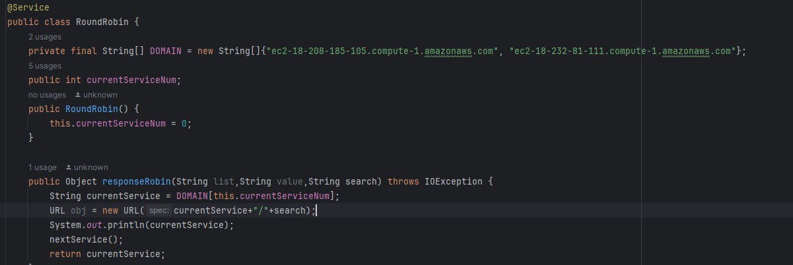
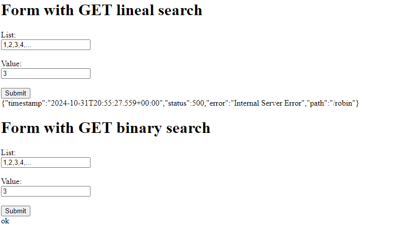
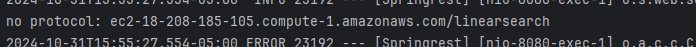

# ServiceProxyParcial
Este será el proxy que estaba haciendo. Quedó ya el funcionamiento de  roundrobin con las instancias de los servicos configurados. Falta es hacer las peticiones y manejar esa respuesta. Este servicio no se logró poner en la nube.

Esta es la página del cliente ya configurada para la respuesta.

En general, del parcial solo faltó esa conexión entre proxy y servicios y subirlo a nube. La configuración del puerto con variables de entorno solo está para el rest.

LLamado a la instancia del servico MathService.